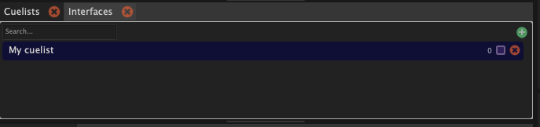
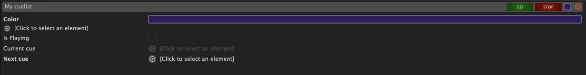
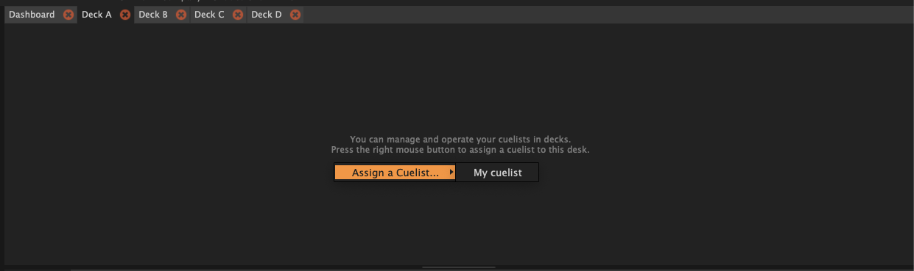
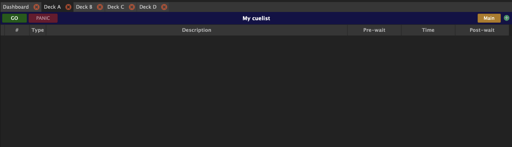

Les Cuelists sont au cœur de SnoringPony. Elles permettent d'organiser et d'enchaîner vos cues pendant un spectacle.

Il existe deux types de cuelist :
- [**Playback cuelist**](/cuelists/playback-cuelist/) : Permet de déclencher des cues de manière séquentielle, en suivant l'ordre défini dans la cuelist.
- [**DCA Mixing cuelist**](/cuelists/dca-mixing-cuelist/) : Permet de contrôler les faders de votre console de mixage audio pour faire du mixage DCA en direct pendant votre spectacle.

# Création d'une nouvelle cuelist

Pour créer une nouvelle cuelist, cliquez sur le bouton "+" dans la partie droite du panel des cuelists et sélectionner le type de cuelist que vous souhaitez créer.

*Liste des cuelists de la session*

Dans la configuration d'une cuelist, il est possible de pouvoir ajouter une couleur pour pouvoir vous y retrouver plus facilement lorsque vous avez plusieurs cuelists dans votre session.
Pour cela, il suffit de cliquer sur la cuelist que vous souhaiter modifier dans la liste des cuelists, puis de regarder dans le panel `Inspector`.

*Configuration d'une cuelist*

# Assigner une cuelist à un deck

Afin de pouvoir visualiser une cuelist, celle-ci doit être assignée à un Deck. Il existe 4 Decks disponibles dans SnoringPony, chacun pouvant afficher une cuelist différente.

Pour assigner une cuelist à un Deck, il suffit de faire un clique droit sur un deck vide (ou sur l'entête d'une cuelist dans un deck) puis de sélectionner la cuelist à afficher dans le deck.

*Assigner une cuelist à un deck*

*Cuelist assignée à un deck*

> [!TIP]
> La couleur assignée à la cuelist est affichée dans l'entête du deck pour vous permettre de les différencier
> facilement lorsque vous avez plusieurs cuelists assignées à différents decks.

> [!TIP]
> Il est possible d'assigner des presets de couleurs directement si vous
> utilisez plusieurs fois la même couleurs. Pour cela, il faut aller dans les
> paramètres du projet actuellement ouvert.

# Cuelist Main ?

Une cuelist main, est la cuelist qui est utilisée pour le panel de contrôle `Show Control` et `Show Infos` (accessible via le menu `View`).

Il est possible d'assigner une cuelist d'un deck en tant que main en cliquant sur `Main` à droite de l'entête dans le deck.

> [!TIP]
> Généralement, la cuelist principale de votre spectacle doit être déclarée en
> `Main` pour pouvoir être contrôlée facilement depuis le panel de contrôle `Show Control` et `Show Infos`. Les autres
> cuelists peuvent être utilisée pour le DCA Mixing, l'entracte ou autre.
