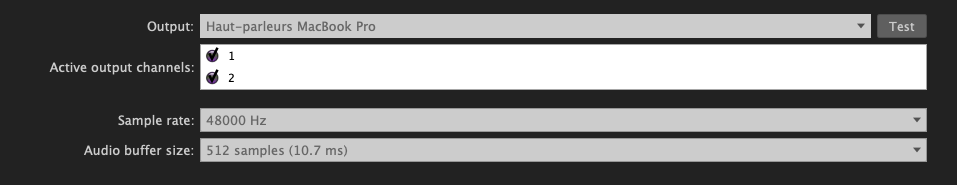
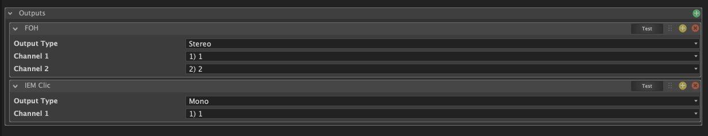

Une interface audio dans SnoringPony est un composant qui permet de gérer les **sorties audio** pour les [**cues audio**](/cues/audio-cue/).

C'est une partie essentielle de la configuration de votre spectacle, car elle détermine **comment et où le son sera diffusé**.

Il est possible d'avoir **plusieurs interfaces audio** dans un même spectacle mais également **plusieurs sorties audio** dans une même interface, ce qui permet de diffuser le son sur **plusieurs zones différentes** (ex : scène, salle, lointain, etc..).

> [!WARNING]
> Si vous utilisez SnoringPony pour la diffusion sonore de votre spectacle, il
> sera nécessaire d'avoir au moins une interface audio d'ajoutée à votre projet,
> ainsi qu'une sortie audio configurée pour diffuser le son sur votre matériel.

## Configuration générale

*Configuration d'une interface audio*

Une fois l'interface ajoutée, il est nécessaire de configurer l'**appareil de sortie audio** à utiliser, les différents **canaux audio** qui seront utilisés pour diffuser le son, mais également le **sample rate** et la **taille des buffers** pour assurer une diffusion fluide du son avec votre matériel.

## Configuration des sorties audio

*Configuration des outputs d'une interface audio*

Ensuite, il est nécessaire de configurer les différents **output** qui seront utilisés dans les [**cues audio**](/cues/audio-cue/) de votre spectacle. Chaque output correspond à une **zone de diffusion sonore** (ex : scène, salle, lointain, etc..) et peut être configuré avec un **nom personnalisé**.

Il est possible de **tester chaque sortie** en cliquant sur le bouton **"Test"** à droite de chaque output, ce qui permet de s'assurer que le son est correctement diffusé sur la zone correspondante.

> [!TIP]
> Il est possible de créer un output spécifiquement pour la preview de cue, et
> d'assigner cet output là directement dans les paramètres du projet.
