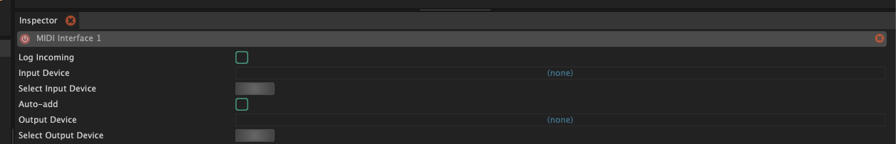
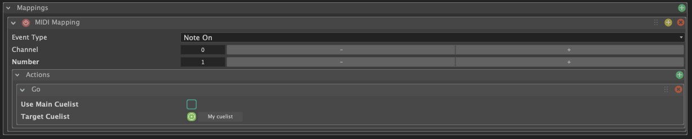
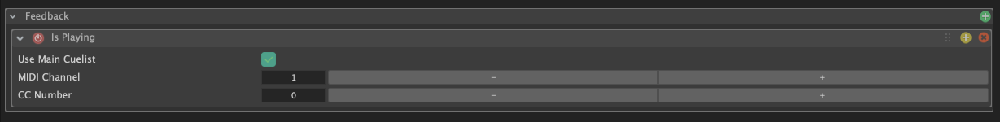

Une interface MIDI dans SnoringPony permet de connecter des **appareils MIDI** (claviers, contrôleurs, etc.) au logiciel afin notamment de pouvoir **effectuer une action** sur SnoringPony directement lors d'un appuie sur une touche de vos contrôleurs.

Il est également possible d'**envoyer des messages MIDI** depuis SnoringPony vers vos appareils, pour **allumer une lumière** sur votre contrôleur lorsqu'une cue est active par exemple.

## Configuration générale

*Configuration d'une interface MIDI*

Une fois l'interface MIDI ajoutée, il est nécessaire de configurer les **appareils MIDI** à utiliser pour envoyer et recevoir des messages MIDI.
Pour cela, il suffit de cliquer sur le bouton **"Select Input Device"** et **"Select Output Device"**.

Selectionner un appareil MIDI en **entrée** permettra de **déclencher des actions** dans SnoringPony lors d'un appuie sur une touche de votre contrôleur (**mapping**), tandis que selectionner un appareil MIDI en **sortie** permettra d'**envoyer des messages MIDI** lors d'un évènement spécifique de SnoringPony vers votre contrôleur (**feedback**).

## Mapping MIDI

*Configuration du mapping d'une interface MIDI*

Le **mapping MIDI** permet d'effectuer **une ou plusieurs actions** lors d'une action sur votre contrôleur MIDI.

> [!TIP]
> Vous pouvez cocher la checkbox **"Auto-add"** afin de déclarer automatiquement une action lors de la réception d'un message MIDI envoyé par votre contrôleur en entrée.

Voici les actions possibles lors d'un évènement MIDI reçu en entrée :
- **GO** : déclenchement de la next cue dans une cuelist spécfique.
- **Panic** : action "Panic" qui arrête toutes les cues actuellement en cours d'exécution.
- **Select next cue** : sélection de la prochaine cue dans une cuelist spécfique.
- **Select previous cue** : sélection de la cue précédente dans une cuelist spécfique.

> [!NOTE]
> Les actions ciblants une cuelist peuvent sélectionner automatiquement la
> cuelist déclarée actuellement comme étant la main cuelist.

## Feedback MIDI

*Configuration du feedback d'une interface MIDI*

Voici les feedbacks possibles qui sont envoyés en MIDI vers votre appareil :
- **Is Playing** : message envoyé lorsqu'une cue d'une cuelist spécifique est actuellement **en cours de lecture**. (`255` si actif, `0` sinon)
- **Is Panicking** : message envoyé lorsque le mode **"Panic"** est déclenché sur une cuelist spécifique. (`255` si actif, `0` sinon)

> [!NOTE]
> Les feedbacks ciblants une cuelist peuvent sélectionner automatiquement la
> cuelist déclarée actuellement comme étant la main cuelist.
