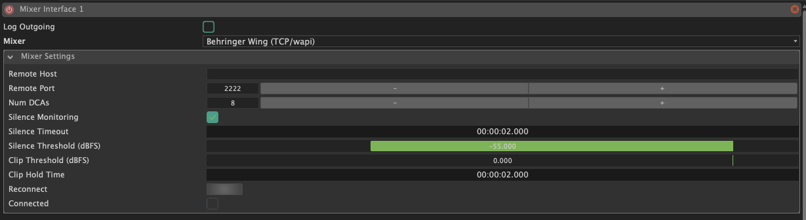
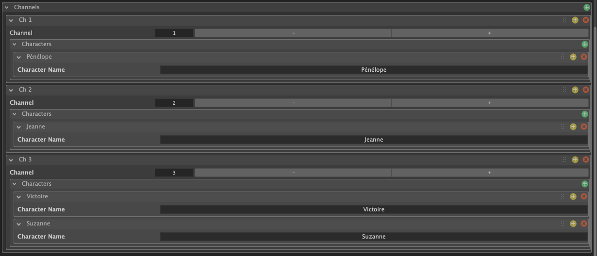
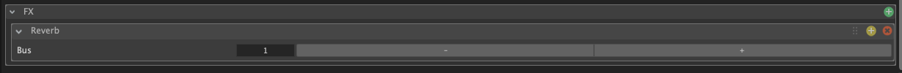

Afin de pouvoir utiliser les fonctionnalités de **DCA Mixing**, il est nécessaire de configurer une interface de type **Mixer**. Cette interface permet à SnoringPony de **communiquer avec votre table de mixage**, afin de pouvoir **contrôler les DCAs automatiquement** dans les cues d'une [DCA Mixing Cuelist](../../cuelists/dca-mixing-cuelist).

## Tables de mixage compatibles

SnoringPony est compatible avec les tables de mixage suivantes :

- [Behringer WING Rack](https://www.behringer.com/en/products/0603-AEV)
- [Behringer WING Compact](https://www.behringer.com/en/products/0603-AEV)
- [Behringer WING Fullsize](https://www.behringer.com/en/products/0603-AEV)
- [Allen & Heath SQ-12T](https://www.allen-heath.com/hardware/cq/cq-12t/)
- [Allen & Heath SQ-18T](https://www.allen-heath.com/hardware/cq/cq-18t/)

> [!WARNING]
> Pour les consoles Allen & Heath, le mixage DCA n'est pas pris en charge,
> néanmoins SnoringPony permet de muter et démuter les canaux en fonction des
> cues d'une [DCA Mixing Cuelist](/cuelists/dca-mixing-cuelist/).

> [!WARNING]
> Pour les consoles Behringer, il est possible d'utiliser soit le protocole OSC
> soit le protocole TCP/IP. Merci de bien autoriser les communications [OSC](/interfaces/osc/) et/ou
> TCP/IP dans les paramètres de votre console de mixage, et de configurer l'interface Mixer en conséquence.

# Configuration générale

*Configuration générale d'une interface Mixer*

Pour configurer une interface de type Mixer, il est nécessaire de renseigner tout d'abord le **type de table de mixage** que vous souhaitez connecter à SnoringPony. En fonction de ce que vous avez sélectionné, différentes options s'affichent pour vous permettre de configurer correctement la **connexion** entre SnoringPony et votre console de mixage.

> [!TIP]
> Dans le cas d'une utilisation d'une console Behringer Wing, vous avez la
> possibilité de **monitorer les silences anormaux** qui pourraient suggérer un souci
> sur le micro ou le canal et dans ce cas là, la couleur du canal clignote en
> rouge sur la console.
>
> De même, il y a une option permettant de **monitorer si un canal clip** ou non. Si
> un canal clip, alors la console affichera la couleur rouge pendant quelques
> secondes sur le canal en question.
>
> Vous pouvez activer ou non ces options là, ainsi que configurer les seuils de
> silence et de clipping, en fonction de votre configuration et de vos besoins.

# Configuration des canaux

*Configuration du mapping des canaux d'une interface Mixer*

Dans cette section, vous avez la possibilité de définir les **différents canaux** ainsi que les **personnages associés** à chacun de ces canaux. Il est possible de spécifier **plusieurs personnages pour un même canal**, ce qui peut être très pratique dans le cas où vous avez plusieurs personnages qui partagent un même micro.

> [!TIP]
> Vous pouvez spécifier le nom de chaque canal directement en **double cliquant**
> sur le titre de chaque canal.

# Configuration des effets

*Configuration des effets d'une interface Mixer*

Sur certaines tables de mixage, il est possible d'**activer ou de désactiver des effets** sur les canaux, comme par exemple une **réverbe** ou un **délai**.

Ces effets peuvent être ponctuellement **actifs en fonction des cues**, et cela pourra être **automatisé** dans la [DCA Mixing Cuelist](/cuelists/dca-mixing-cuelist/).

Pour ce faire, il est nécessaire de définir **un bus par effet**. SnoringPony se charge de **router les canaux vers les bus d'effets** nécessaires en fonction de la [Cuelist](/cuelists/).
