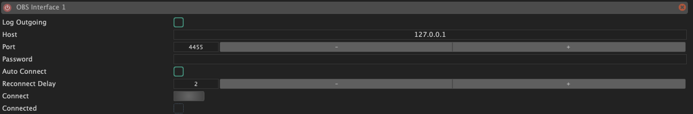
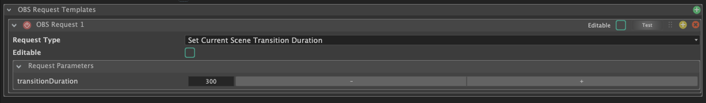

Les interfaces OBS permettent à SnoringPony de **communiquer avec OBS** (Open Broadcaster Software) pour contrôler divers aspects tels que les **scènes**, les **sources**, les **transitions**, etc.

Il est possible d'utiliser des [OBS Cues](/cues/obs-cue/) afin de **déclencher des actions spécifiques** dans OBS, comme changer de scène ou activer/désactiver une source, directement depuis vos [Cuelists](/cuelists/) dans SnoringPony.

## Configuration de l'interface OBS

*Configuration de l'interface OBS*

Afin de connecter SnoringPony à OBS, il est nécessaire de configurer les **paramètres suivants** dans l'interface OBS de SnoringPony :
- **Host** : l'adresse IP ou le nom d'hôte de la machine sur laquelle OBS est installé. Par défaut, il s'agit de `127.0.0.1` si OBS est installé sur la même machine que SnoringPony.
- **Port** : le port utilisé par OBS pour la communication via WebSocket. Par défaut, il s'agit de `4455` pour les versions récentes d'OBS, mais cela peut être différent si vous utilisez une version plus ancienne ou si vous avez modifié ce paramètre dans OBS.
- **Password** : le mot de passe configuré dans OBS pour la connexion via WebSocket. Par défaut, il n'y en a pas, mais il est recommandé d'en configurer un pour des raisons de sécurité.
- **Auto Connect** : si cette option est activée, SnoringPony tentera de se
  connecter **automatiquement** à OBS au démarrage du logiciel et de se **reconnecter en cas de déconnexion**. (un délai de 2 secondes est appliqué avant chaque tentative et est configurable via le champ `Reconnect delay`)

## Templates d'actions OBS

*Configuration des templates d'actions OBS*

Afin de faciliter la configuration des [OBS Cues](/cues/obs-cue/) et d'éviter de devoir renseigner à chaque fois les mêmes informations pour les actions OBS, il est possible de configurer des **templates d'actions OBS** dans la section `OBS Request Templates`.

Il est également possible de cocher la checkbox **"Editable"** afin de rendre les arguments **modifiables directement** depuis les [OBS Cues](/cues/obs-cue/), ce qui peut être très pratique pour certains types d'actions OBS.

Voici les actions OBS prises en charge actuellement :
- **Set Current Program Scene** : permet de changer la scène actuellement active dans OBS.
- **Set Current Preview Scene** : permet de changer la scène actuellement en preview dans OBS.
- **Set Current Scene Transition** : permet de changer la transition et sa durée actuellement active dans OBS.
- **Set Current Scene Transition Duration** : permet de changer la durée de la transition actuellement active dans OBS.
- **Trigger Studio Mode Transition** : permet de déclencher une transition en mode studio dans OBS. (Passer d'une scène en preview à la scène active, ou inversement)
- **Set Scene Item Enabled** : permet d'activer ou désactiver une source spécifique dans une scène d'OBS.
- **Set Input Mute** : permet de muter ou démuter une source sonore d'une scène OBS.
- **Custom** : permet de définir une action totalement spécifique pour une utilisation plus avancée d'OBS.
