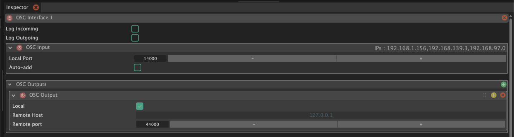
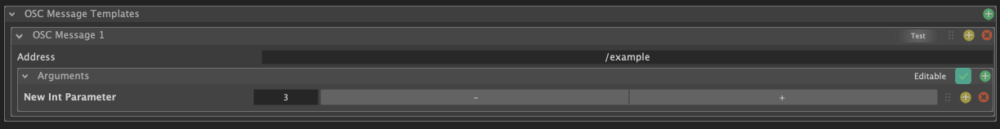
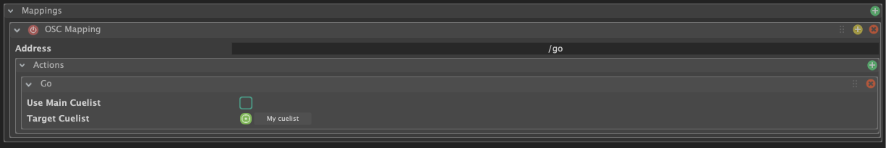
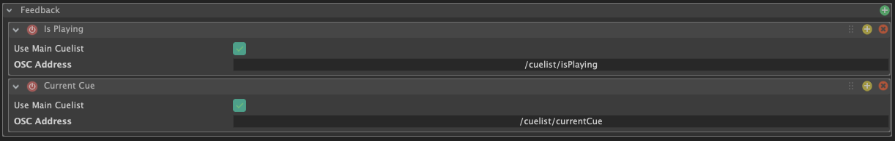

Une interface OSC dans SnoringPony permet d'**envoyer et recevoir des messages OSC** (Open Sound Control) depuis et vers d'autres applications ou dispositifs compatibles.

Ces messages peuvent être utilisés pour **déclencher des actions** depuis SnoringPony, ou pour **contrôler SnoringPony** à partir d'autres logiciels ou matériels utilisant ce protocole de communication.

> [!TIP]
> Il est possible de contrôler intégralement SnoringPony en passant par l'OSC
> Remote control configurable dans les paramètres généraux du logiciel.

## Configuration générale

*Configuration d'une interface OSC*

Afin de recevoir des messages OSC, il est nécessaire de sélectionner un **port d'écoute** dans `OSC Input` (qui devra être configuré dans l'application ou le dispositif qui envoie les messages OSC). Par défaut, ce port est configuré à `14000`.

Pour envoyer des messages OSC, il est nécessaire de configurer **une ou plusieurs destinations d'envoi**, en renseignant l'**adresse IP** et le **port d'écoute** de chaque destination dans `OSC Outputs`.

> [!TIP]
> Il est possible de cocher les cases `Log Incoming / Outgoing` afin de voir dans la console de SnoringPony les messages OSC qui sont reçus et envoyés, ce qui peut être très utile pour le debug.

## Templates de messages OSC

*Configuration des templates de messages OSC*

Afin de faciliter la configuration des [OSC Cues](/cues/osc-cue/) et d'éviter de devoir renseigner à chaque fois les mêmes informations pour les messages OSC envoyés, il est possible de configurer des **templates de messages OSC** dans la section `OSC Message Templates`.

Il est également possible de cocher la checkbox **"Editable"** afin de rendre les arguments **modifiables directement** depuis les [OSC Cues](/cues/osc-cue/), ce qui peut être très pratique pour certains types de messages OSC.

> [!TIP]
> En double cliquant sur le nom du template ou des arguments, il est possible de
> saisir un nouveau nom plus parlant pour votre projet.

## Mapping OSC

*Configuration du mapping de l'interface OSC*

Le **mapping OSC** permet d'effectuer **une ou plusieurs actions** lors de la réception d'un message OSC spécifique.

Voici les actions possibles :
- **GO** : déclenchement de la next cue dans une cuelist spécfique.
- **Panic** : action "Panic" qui arrête toutes les cues actuellement en cours d'exécution.
- **Select next cue** : sélection de la prochaine cue dans une cuelist spécfique.
- **Select previous cue** : sélection de la cue précédente dans une cuelist spécfique.

> [!NOTE]
> Les actions ciblants une cuelist peuvent sélectionner automatiquement la
> cuelist déclarée actuellement comme étant la main cuelist.

## Feedback OSC

*Configuration du feedback d'une interface OSC*

Voici les feedbacks possibles qui sont envoyés via un message OSC vers votre appareil :
- **Is Playing** : message envoyé lorsqu'une cue d'une cuelist spécifique est actuellement **en cours de lecture**. (`1` si actif, `0` sinon)
- **Is Panicking** : message envoyé lorsque le mode **"Panic"** est déclenché sur une cuelist spécifique. (`1` si actif, `0` sinon)
- **Current Cue** : message envoyé lorsqu'une cue est active dans une cuelist spécifique, avec comme argument le **nom de la cue sélectionnée**.
- **Next Cue** : message envoyé lorsque la prochaine cue est sélectionnée dans une cuelist spécifique, avec comme argument le **nom de la prochaine cue à jouer**.

> [!NOTE]
> Les feedbacks ciblants une cuelist peuvent sélectionner automatiquement la
> cuelist déclarée actuellement comme étant la main cuelist.
